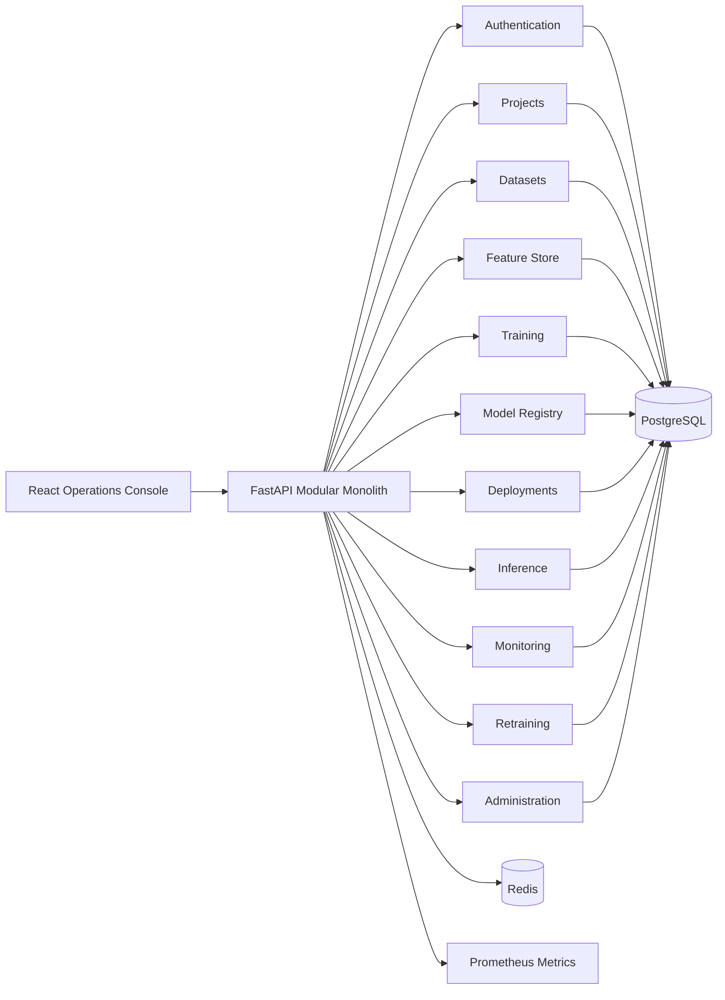
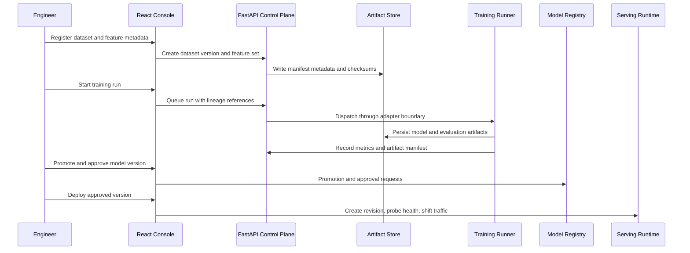
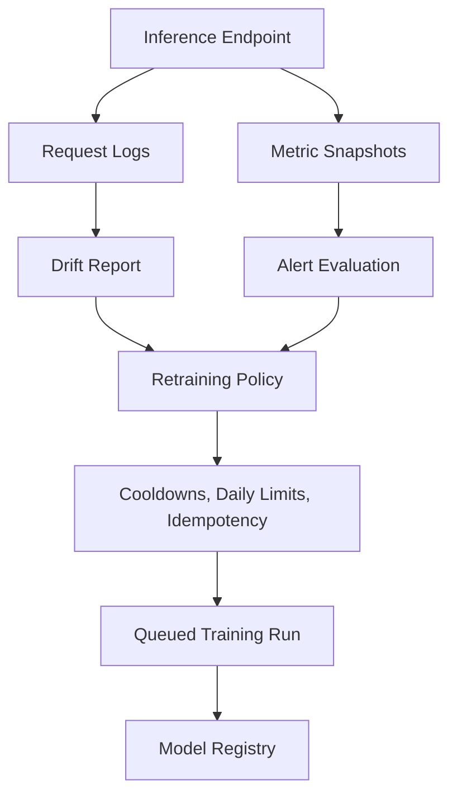
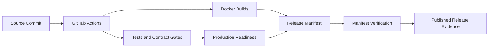

# ForgeML Architecture Diagrams

These diagrams are intended for technical walkthroughs. They complement
`docs/architecture-walkthrough.md` with compact visuals that can be pasted into
GitHub Markdown, a portfolio site, or interview notes.

## Modular Monolith

## ML Lifecycle

## Monitoring To Retraining

## Release Governance

