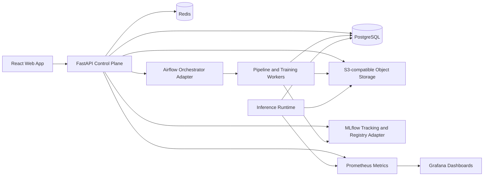

# System Architecture

ForgeML is a modular monolith control plane with clearly separated domain modules, asynchronous execution, and production-grade integrations for ML workflow orchestration, experiment tracking, artifact storage, observability, and deployment.

## Architectural Goals

- Provide a coherent web product for ML engineers.
- Preserve strong domain boundaries from day one.
- Support multiple projects, datasets, models, experiments, and deployments.
- Make training and inference extensible without hardcoding model families.
- Keep infrastructure replaceable behind interfaces.
- Expose first-class auditability, observability, and security.

## High-Level Components

## Control Plane and Data Plane

The control plane manages users, projects, metadata, policies, approvals, deployment records, and workflow requests. The data plane performs heavy ML work such as validation, feature materialization, training, evaluation, batch inference, online inference, monitoring jobs, and drift analysis.

Initial deployment can keep both planes in one repository and one platform, but their runtime profiles should be separated:

| Plane | Responsibilities | Runtime |
| --- | --- | --- |
| Control plane | APIs, metadata, auth, RBAC, UI coordination | FastAPI, Postgres, Redis |
| Workflow plane | DAG scheduling, retries, backfills, training orchestration | Airflow |
| Inference plane | Prediction serving, canary, rollback, health checks | Containerized inference runtime |
| Observability plane | Metrics, logs, traces, dashboards, alerting | Prometheus, Grafana, OpenTelemetry |

## Clean Architecture Layers

Each module has four layers:

| Layer | Owns | Forbidden Dependencies |
| --- | --- | --- |
| API | HTTP routes, request validation, auth guards | SQLAlchemy models, cloud clients |
| Application | Use cases, transactions, orchestration, authorization checks | FastAPI request objects |
| Domain | Entities, value objects, policies, domain events | Frameworks, persistence, network clients |
| Infrastructure | SQLAlchemy repositories, Redis, MLflow, Airflow, S3, external adapters | Business rule ownership |

## Module Responsibilities

### Authentication

Owns identity, JWT issuance, refresh tokens, password hashing, service accounts, API keys, RBAC, and permission checks.

### Projects

Owns project metadata, project membership, project-scoped configuration, ownership, and lifecycle state.

### Datasets

Owns dataset definitions, immutable dataset versions, schema validation, storage locations, and validation reports.

### Feature Store

Owns feature sets, feature definitions, feature pipeline metadata, materialization records, online/offline feature references, and feature lineage.

### Training

Owns training run requests, pipeline configuration, hyperparameter search requests, retry policies, and training lifecycle.

### Experiment Tracking

Owns ForgeML experiment abstractions, metrics, parameters, run status, and MLflow adapter integration.

### Model Registry

Owns registered models, versions, artifact metadata, approval state, promotion rules, and model lineage.

### Deployment

Owns deployment records, rollout plans, canary state, rollback state, environment promotion, and runtime configuration.

### Inference

Owns inference endpoint contracts, prediction request validation, prediction response metadata, latency/error metrics, and prediction sampling.

### Monitoring

Owns service health, training metrics, inference metrics, operational dashboards, and metric metadata.

### Alerting

Owns alert rules, alert events, notification routing, severity, acknowledgement, and resolution state.

### Drift Detection

Owns reference windows, production windows, feature drift reports, prediction drift reports, statistical tests, and retraining triggers.

### Administration

Owns platform-wide settings, audit search, quota policies, feature flags, and system status.

## Workflow Orchestration

Airflow should own long-running workflows:

- Dataset validation
- Dataset profiling
- Feature materialization
- Training
- Hyperparameter search
- Evaluation
- Model packaging
- Batch inference
- Drift analysis
- Retraining

ForgeML should not expose raw Airflow concepts directly in the product UI. The application layer should translate platform workflows into Airflow DAG runs through an orchestration interface.

## Experiment and Model Tracking

MLflow should be integrated behind ForgeML-owned ports:

- `ExperimentTracker`
- `RunArtifactStore`
- `ModelRegistryGateway`

This allows ForgeML to use MLflow's maturity while preserving the option to replace or augment it later.

## Data and Artifact Storage

Postgres stores metadata and relational state. Object storage stores large immutable data:

- Uploaded dataset objects
- Dataset profile reports
- Validation reports
- Feature snapshots
- Training artifacts
- Model binaries
- Evaluation reports
- Drift reports
- Prediction log exports

Redis stores ephemeral data:

- Rate limit counters
- Short-lived job status cache
- Web UI session coordination
- Distributed locks where required
- Background task coordination for small control-plane tasks

## Eventing Model

Domain events should be emitted inside the monolith and persisted using an outbox table. Initially, event dispatch can be in-process plus background polling. Later, the outbox can publish to Kafka, SNS/SQS, or another broker without changing domain logic.

Examples:

- `DatasetVersionCreated`
- `DatasetValidationCompleted`
- `TrainingRunStarted`
- `TrainingRunCompleted`
- `ModelVersionRegistered`
- `ModelVersionApproved`
- `DeploymentRolledOut`
- `DriftDetected`
- `RetrainingTriggered`

## Multi-Tenancy Model

Initial implementation should support organization-scoped tenancy:

- Users belong to one or more organizations.
- Projects belong to one organization.
- Most domain tables include `organization_id` and `project_id` where applicable.
- Authorization is enforced in application services and repository filters.
- Database row-level security can be added later after the application policy layer is stable.

## Scalability Posture

The initial architecture scales vertically and horizontally where it matters:

- API replicas are stateless.
- Training and workflow execution run outside API request lifecycles.
- Inference runtimes can scale independently.
- Metrics are externalized to Prometheus.
- Large artifacts never pass through Postgres.
- Long-running workflows are idempotent and resumable.

## Non-Goals for the Initial Architecture

- No microservices at launch.
- No custom workflow orchestrator.
- No custom experiment tracking database when MLflow can be adapted.
- No hardcoded assumptions for the three sample projects.
- No production GPU scheduling in the first sprint.
- No streaming feature store in the first release unless required by a later decision.
