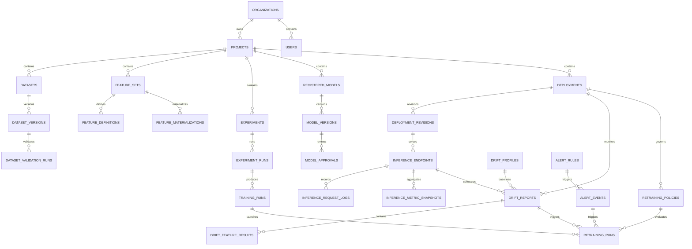

# Database Schema

PostgreSQL is the system of record for ForgeML metadata, workflow state, authorization state, audit trails, and relational lineage. Large datasets, model artifacts, reports, and logs live in object storage and are referenced by immutable URIs.

## Schema Principles

- Use UUID primary keys.
- Include `created_at` and `updated_at` on mutable records.
- Use immutable versions for datasets, feature sets, model versions, and deployment revisions.
- Include `organization_id` for tenant isolation.
- Include `project_id` for project-scoped ML assets.
- Prefer explicit status enums over free-form strings.
- Store large payloads in object storage, not Postgres.
- Use optimistic concurrency for approval and deployment workflows.
- Use Alembic migrations for all schema changes.

## Core Tables

### Organizations and Users

| Table | Purpose | Key Columns |
| --- | --- | --- |
| `organizations` | Tenant root | `id`, `name`, `slug`, `status`, `created_at` |
| `users` | Human users | `id`, `email`, `display_name`, `password_hash`, `status`, `last_login_at` |
| `service_accounts` | Automation identities | `id`, `organization_id`, `name`, `status`, `created_by` |
| `roles` | RBAC roles | `id`, `organization_id`, `name`, `description`, `is_system_role` |
| `permissions` | Permission catalog | `id`, `resource`, `action`, `description` |
| `role_permissions` | Role permission mapping | `role_id`, `permission_id` |
| `user_roles` | User role assignments | `user_id`, `role_id`, `organization_id`, `project_id` |
| `api_keys` | Hashed API keys | `id`, `principal_type`, `principal_id`, `key_hash`, `expires_at`, `last_used_at` |
| `refresh_tokens` | JWT refresh state | `id`, `user_id`, `token_hash`, `expires_at`, `revoked_at` |

### Projects

| Table | Purpose | Key Columns |
| --- | --- | --- |
| `projects` | ML project container | `id`, `organization_id`, `name`, `slug`, `description`, `status`, `owner_user_id` |
| `project_memberships` | Project access | `project_id`, `user_id`, `role_id`, `created_at` |
| `project_settings` | Project-level configuration | `project_id`, `key`, `value_json`, `updated_by` |

### Dataset Management

| Table | Purpose | Key Columns |
| --- | --- | --- |
| `datasets` | Logical dataset | `id`, `organization_id`, `project_id`, `name`, `description`, `source_type`, `status` |
| `dataset_versions` | Immutable dataset version | `id`, `dataset_id`, `version`, `object_uri`, `content_hash`, `row_count`, `size_bytes`, `created_by` |
| `dataset_schemas` | Versioned schema | `id`, `dataset_version_id`, `schema_json`, `inferred`, `schema_hash` |
| `dataset_validation_runs` | Validation execution | `id`, `dataset_version_id`, `status`, `started_at`, `finished_at`, `report_uri`, `error_message` |
| `dataset_profiles` | Profile summaries | `id`, `dataset_version_id`, `profile_uri`, `summary_json` |

### Feature Store

| Table | Purpose | Key Columns |
| --- | --- | --- |
| `feature_sets` | Logical feature group | `id`, `organization_id`, `project_id`, `name`, `description`, `entity_key`, `status` |
| `feature_definitions` | Individual features | `id`, `feature_set_id`, `name`, `dtype`, `description`, `nullable`, `constraints_json` |
| `feature_pipelines` | Pipeline metadata | `id`, `feature_set_id`, `name`, `source_dataset_id`, `code_ref`, `schedule_cron`, `status` |
| `feature_materializations` | Materialized feature version | `id`, `feature_set_id`, `pipeline_id`, `version`, `offline_uri`, `online_ref`, `status` |
| `feature_lineage` | Feature dependency graph | `id`, `feature_set_id`, `upstream_type`, `upstream_id`, `created_at` |

### Experiments and Training

| Table | Purpose | Key Columns |
| --- | --- | --- |
| `experiments` | Experiment container | `id`, `organization_id`, `project_id`, `name`, `description`, `tracking_backend`, `external_ref` |
| `experiment_runs` | Run metadata | `id`, `experiment_id`, `run_name`, `status`, `started_at`, `finished_at`, `external_ref`, `created_by` |
| `experiment_params` | Run parameters | `id`, `run_id`, `key`, `value` |
| `experiment_metrics` | Run metrics | `id`, `run_id`, `key`, `value`, `step`, `timestamp` |
| `experiment_artifacts` | Run artifacts | `id`, `run_id`, `artifact_type`, `object_uri`, `metadata_json` |
| `training_runs` | Training request lifecycle | `id`, `organization_id`, `project_id`, `experiment_id`, `experiment_run_id`, `dataset_version_id`, `feature_set_id`, `status`, `algorithm`, `orchestrator_run_id` |
| `training_run_events` | Training lifecycle events | `id`, `training_run_id`, `event_type`, `message`, `metadata_json` |
| `hyperparameter_searches` | Tuning jobs | `id`, `training_run_id`, `strategy`, `search_space_json`, `objective_metric`, `status` |
| `evaluation_reports` | Model evaluation outputs | `id`, `run_id`, `dataset_version_id`, `metrics_json`, `report_uri`, `created_at` |

### Model Registry

| Table | Purpose | Key Columns |
| --- | --- | --- |
| `registered_models` | Logical model package | `id`, `organization_id`, `project_id`, `name`, `description`, `model_type`, `status` |
| `model_versions` | Immutable model version | `id`, `registered_model_id`, `version`, `run_id`, `artifact_uri`, `signature_json`, `metrics_json`, `status` |
| `model_approvals` | Approval workflow | `id`, `model_version_id`, `requested_by`, `reviewed_by`, `status`, `reason`, `reviewed_at` |
| `model_lineage` | Model dependency graph | `id`, `model_version_id`, `upstream_type`, `upstream_id`, `created_at` |

### Deployment and Inference

| Table | Purpose | Key Columns |
| --- | --- | --- |
| `deployments` | Logical deployment target | `id`, `organization_id`, `project_id`, `name`, `environment`, `status` |
| `deployment_revisions` | Immutable deployed config | `id`, `deployment_id`, `model_version_id`, `revision`, `runtime_config_json`, `serving_image`, `traffic_percentage`, `status` |
| `deployment_health_checks` | Revision health observations | `id`, `deployment_revision_id`, `status`, `latency_ms`, `error_rate`, `details_json`, `created_at` |
| `deployment_events` | Canary, rollback, and rollout history | `id`, `deployment_id`, `deployment_revision_id`, `event_type`, `message`, `metadata_json`, `created_at` |
| `inference_endpoints` | Endpoint metadata | `id`, `organization_id`, `project_id`, `deployment_id`, `deployment_revision_id`, `route_path`, `status` |
| `inference_request_logs` | Immutable prediction records | `id`, `endpoint_id`, `deployment_revision_id`, `request_id`, `status`, `latency_ms`, `input_payload_json`, `output_payload_json`, `error_message` |
| `inference_metric_snapshots` | Aggregated endpoint metrics | `id`, `endpoint_id`, `window_seconds`, `prediction_count`, `error_count`, `p50_latency_ms`, `p95_latency_ms` |

### Monitoring, Drift, Alerting, Retraining

| Table | Purpose | Key Columns |
| --- | --- | --- |
| `metric_catalog` | Platform metric definitions | `id`, `name`, `description`, `unit`, `owner_module` |
| `drift_profiles` | Reference profiles | `id`, `organization_id`, `project_id`, `model_version_id`, `dataset_version_id`, `baseline_profile_json`, `status` |
| `drift_reports` | Drift analysis result | `id`, `organization_id`, `project_id`, `drift_profile_id`, `endpoint_id`, `deployment_id`, `deployment_revision_id`, `drift_score`, `summary_json` |
| `drift_feature_results` | Feature-level drift scores | `id`, `drift_report_id`, `feature_name`, `feature_type`, `drift_score`, `threshold`, `drift_detected`, `statistics_json` |
| `alert_rules` | Alert definitions | `id`, `organization_id`, `project_id`, `name`, `severity`, `metric`, `operator`, `threshold`, `window_seconds`, `enabled` |
| `alert_events` | Alert instances | `id`, `organization_id`, `project_id`, `alert_rule_id`, `endpoint_id`, `severity`, `status`, `observed_value`, `threshold`, `metadata_json` |
| `notification_channels` | Notification targets | `id`, `organization_id`, `channel_type`, `config_json`, `enabled` |
| `retraining_policies` | Automated retraining rules | `id`, `organization_id`, `project_id`, `deployment_id`, `trigger_type`, `trigger_config_json`, `training_template_json`, `cooldown_seconds`, `max_runs_per_day`, `approval_required`, `enabled`, `status` |
| `retraining_runs` | Automated retraining lifecycle | `id`, `organization_id`, `project_id`, `policy_id`, `deployment_id`, `trigger_type`, `drift_report_id`, `alert_event_id`, `training_run_id`, `status`, `training_config_json`, `decision_metadata_json` |

### Platform Internals

| Table | Purpose | Key Columns |
| --- | --- | --- |
| `audit_log` | Security and domain audit trail | `id`, `organization_id`, `actor_type`, `actor_id`, `action`, `resource_type`, `resource_id`, `metadata_json`, `created_at` |
| `outbox_events` | Reliable domain event dispatch | `id`, `event_type`, `aggregate_type`, `aggregate_id`, `payload_json`, `status`, `created_at`, `processed_at` |
| `idempotency_keys` | Request deduplication | `id`, `key`, `actor_id`, `request_hash`, `response_json`, `expires_at` |
| `feature_flags` | Platform flags | `id`, `organization_id`, `key`, `enabled`, `rules_json` |

## Important Relationships

- `organizations` 1-to-many `projects`
- `projects` 1-to-many datasets, experiments, feature sets, registered models, deployments
- `datasets` 1-to-many `dataset_versions`
- `dataset_versions` 1-to-1 or 1-to-many validation runs, profiles, training runs
- `experiments` 1-to-many `experiment_runs`
- `experiment_runs` 1-to-many params, metrics, artifacts, evaluation reports
- `registered_models` 1-to-many `model_versions`
- `model_versions` 1-to-many deployments through deployment revisions
- `deployments` 1-to-many deployment revisions and drift reports
- `deployment_revisions` 1-to-many inference endpoints and inference request logs
- `inference_endpoints` 1-to-many request logs and metric snapshots
- `drift_profiles` 1-to-many drift reports
- `drift_reports` 1-to-many feature-level drift results
- `alert_rules` 1-to-many `alert_events`
- `deployments` 1-to-many retraining policies
- `retraining_policies` 1-to-many `retraining_runs`
- `retraining_runs` optionally link to drift reports, alert events, and launched training runs

## Indexing Strategy

High-priority indexes:

- `projects(organization_id, slug)`
- `datasets(project_id, name)`
- `dataset_versions(dataset_id, version)`
- `experiments(project_id, name)`
- `experiment_runs(experiment_id, status, started_at)`
- `training_runs(project_id, status, created_at)`
- `registered_models(project_id, name)`
- `model_versions(registered_model_id, version)`
- `deployments(project_id, environment, name)`
- `inference_endpoints(project_id, route_path)`
- `inference_request_logs(endpoint_id, request_id)`
- `inference_request_logs(endpoint_id, created_at)`
- `inference_metric_snapshots(endpoint_id, created_at)`
- `drift_profiles(project_id, slug)`
- `drift_reports(deployment_id, created_at)`
- `drift_reports(project_id, created_at)`
- `drift_feature_results(drift_report_id, drift_score)`
- `alert_rules(project_id, slug)`
- `alert_events(project_id, status)`
- `alert_events(alert_rule_id, endpoint_id)`
- `retraining_policies(project_id, slug)`
- `retraining_policies(deployment_id, status)`
- `retraining_runs(policy_id, status)`
- `retraining_runs(project_id, created_at)`
- `retraining_runs(drift_report_id)`
- `retraining_runs(alert_event_id)`
- `audit_log(organization_id, created_at)`
- `outbox_events(status, created_at)`

## Retention and Partitioning

Inference request logs, metric snapshots, audit log records, experiment metrics, and alert events can become large. The initial schema should support time-based partitioning for:

- `inference_request_logs`
- `inference_metric_snapshots`
- `audit_log`
- `experiment_metrics`
- `alert_events`

Retention policies should be configurable per environment:

| Data Type | Dev | Staging | Production |
| --- | --- | --- | --- |
| Inference request logs | 7 days | 30 days | 90 days default |
| Inference metric snapshots | 30 days | 90 days | 1 year default |
| Audit logs | 30 days | 180 days | 1 year minimum |
| Metrics in Prometheus | 7 days | 30 days | 90 days plus remote storage |
| Artifact storage | Manual cleanup | Lifecycle rules | Lifecycle rules with legal hold option |

## Migration Strategy

- All schema changes go through Alembic.
- Migrations are reviewed in pull requests.
- Destructive migrations require a backfill and rollback plan.
- Enum changes are additive first, then cleanup in a later migration.
- Large table changes use expand-and-contract migrations.
