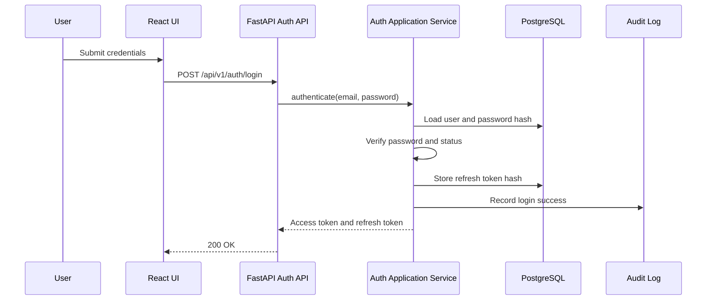
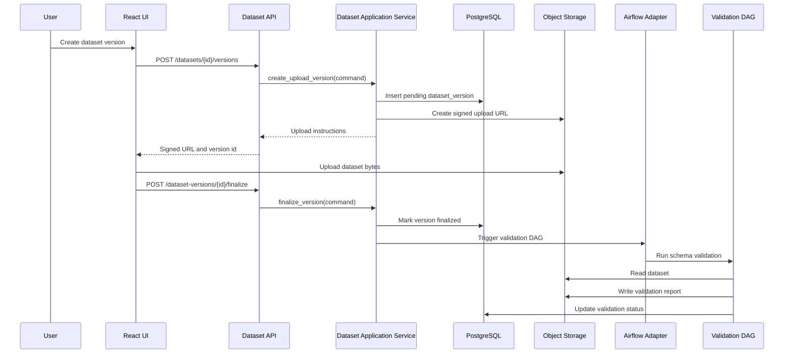
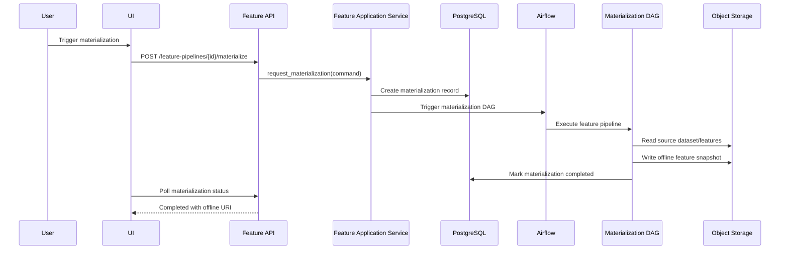
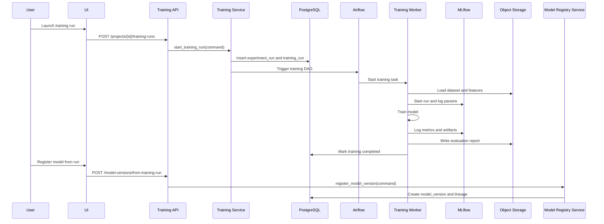
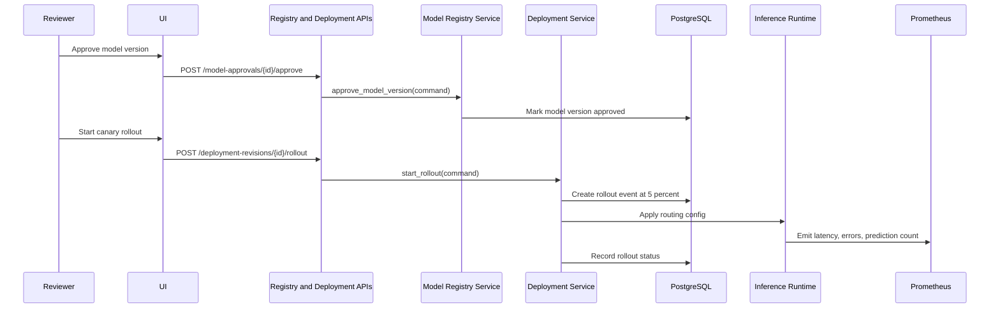
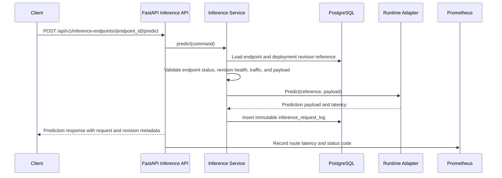
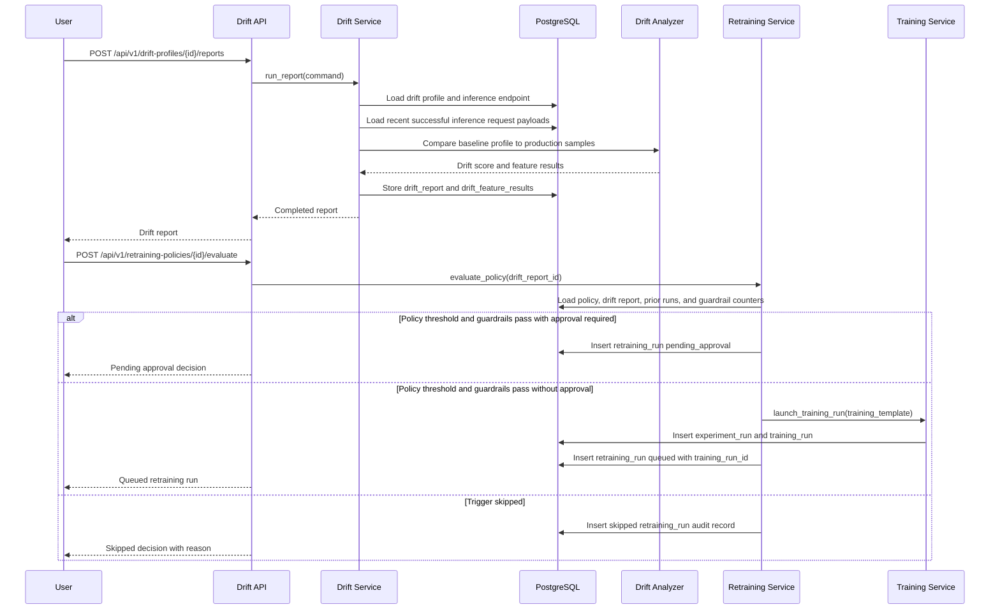
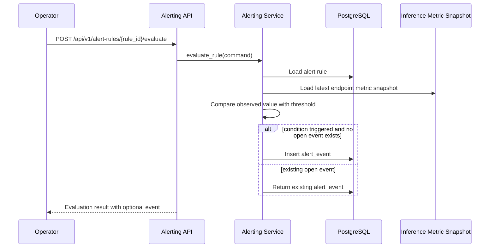
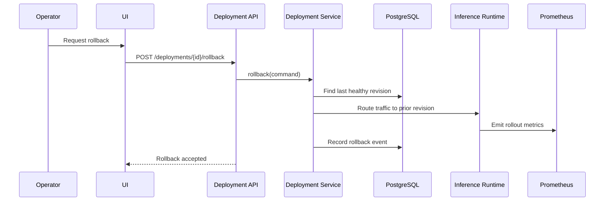

# Sequence Diagrams

These diagrams define the expected control flow for core ForgeML workflows.

## Authentication

## Dataset Upload, Versioning, and Validation

## Feature Materialization

## Training, Evaluation, and Model Registration

## Model Approval and Canary Deployment

## Online Inference and Monitoring

## Drift Detection and Automated Retraining

## Alert Rule Evaluation

## Rollback

