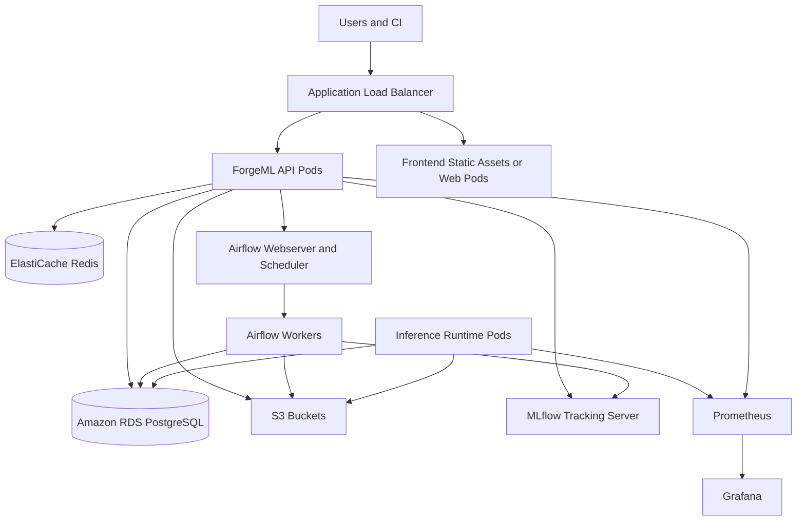

# Deployment Architecture

ForgeML should run locally through Docker Compose and in production on AWS EKS. The production design assumes separate development, staging, and production environments.

## Environments

| Environment | Purpose | Characteristics |
| --- | --- | --- |
| Local | Developer productivity | Docker Compose, local object storage, local Postgres, local Redis |
| CI | Validation | Ephemeral services, test databases, Docker builds |
| Staging | Production-like verification | EKS, RDS, ElastiCache, S3, restricted data |
| Production | User-facing platform | Highly available EKS, managed data stores, backups, monitoring |

## AWS Architecture

## Network Design

- One VPC per environment.
- Public subnets for load balancers and NAT gateways.
- Private subnets for EKS nodes, RDS, Redis, Airflow, MLflow, and internal services.
- Security groups restrict database and Redis access to application workloads.
- S3 access uses IAM roles for service accounts.
- No public database access.

## Compute

Production target: EKS.

Workload classes:

| Workload | Deployment Unit | Scaling |
| --- | --- | --- |
| Frontend | Static assets behind CDN or web pod | CDN scale or replica count |
| API | FastAPI pods | Horizontal pod autoscaler |
| Worker | Control-plane async worker pods | Queue depth and CPU |
| Airflow | Scheduler, webserver, workers | Worker concurrency |
| Training | Kubernetes jobs launched by Airflow | Per-job resources |
| Inference | Model runtime pods | Latency, CPU, request count |
| Monitoring | Prometheus and Grafana | Retention and scrape volume |

## Data Stores

| Store | Production Service | Responsibility |
| --- | --- | --- |
| Relational metadata | Amazon RDS PostgreSQL | Platform state, lineage, approvals, audit |
| Cache and counters | ElastiCache Redis | Rate limiting, locks, ephemeral status |
| Artifacts | S3 | Datasets, models, reports, exported logs |
| Container images | ECR | API, frontend, Airflow, training, inference images |

## Secrets

Secrets should be stored in AWS Secrets Manager or SSM Parameter Store and mounted into workloads through Kubernetes external secrets or environment-specific secret sync.

Secret categories:

- Database credentials
- Redis credentials
- JWT signing keys
- Object storage credentials for local development only
- MLflow backend credentials
- Airflow secret key and connection strings
- Notification provider tokens

## Deployment Flow

1. Pull request runs lint, formatting, tests, and Docker builds.
2. Merge to main builds and pushes versioned images to ECR.
3. Terraform plan runs for infrastructure changes.
4. Application deployment updates staging.
5. Smoke tests and Playwright checks run against staging.
6. Production deployment requires approval.
7. Production rollout uses Kubernetes deployment strategies and model-level canary controls.

## Availability and Recovery

Minimum production posture:

- Multi-AZ RDS.
- Automated RDS backups.
- S3 versioning for critical artifact buckets.
- Redis configured for high availability where supported.
- EKS node groups across at least two availability zones.
- Runbooks for failed migrations, failed training runs, failed deployments, and rollback.

## Production Hardening Path

Later production improvements:

- Dedicated node pools for training and inference.
- GPU node group for deep learning workloads.
- Prometheus remote write for long-term metrics.
- OpenTelemetry collector.
- Centralized log storage.
- Kubernetes network policies.
- Fine-grained IAM roles per workload.
- PrivateLink or VPC endpoints for AWS services.
