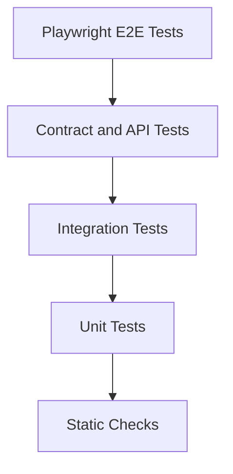

# Testing Strategy

ForgeML should treat tests as part of the architecture. No production code should be merged without appropriate tests for its layer and risk.

## Test Pyramid

## Backend Tests

### Unit Tests

Scope:

- Domain entities
- Value objects
- Policies
- Application services with mocked repositories
- Authorization decisions
- Schema compatibility checks
- Drift threshold logic

Rules:

- No network calls.
- No database dependency.
- Fast enough to run on every save.

### Integration Tests

Scope:

- SQLAlchemy repositories
- Alembic migrations
- Postgres constraints
- Redis rate limiting
- Object storage adapter
- MLflow adapter
- Airflow adapter contract boundaries

Rules:

- Use ephemeral infrastructure in CI.
- Reset database state per test or test class.
- Prefer real Postgres over SQLite for repository tests.

### API Tests

Scope:

- FastAPI routes
- Request and response validation
- Auth enforcement
- Error shapes
- Idempotency behavior
- Pagination

Rules:

- Exercise the API through HTTP clients.
- Assert permission boundaries.
- Assert trace IDs and stable error format.

## Frontend Tests

### Unit and Component Tests

Scope:

- Shared UI components
- Route guards
- Query hooks
- Form validation
- Table filtering and sorting
- State transitions

### Playwright E2E Tests

Critical flows:

- Login
- Create project
- Register dataset
- Finalize dataset version
- View validation result
- Launch training run
- Compare experiment runs
- Register and approve model
- Start canary rollout
- Roll back deployment
- View monitoring and alerts

## ML Workflow Tests

ML workflows need tests beyond ordinary application checks:

| Test Type | Purpose |
| --- | --- |
| Data validation tests | Ensure schema, nulls, ranges, and categorical constraints are enforced |
| Training smoke tests | Confirm each algorithm runner can train on a tiny fixture |
| Evaluation tests | Confirm metric calculations and report generation |
| Reproducibility tests | Confirm seeds and config produce stable expected behavior on fixture data |
| Model signature tests | Confirm inference contract matches registered signature |
| Drift tests | Confirm statistical tests trigger only when thresholds are crossed |

## Contract Tests

Contract tests should protect boundaries:

- Backend OpenAPI contract consumed by frontend.
- MLflow adapter expected behavior.
- Airflow DAG trigger and status interface.
- Inference runtime request/response schema.
- Event payload schemas under `contracts/events`.

## CI Gates

Every pull request should run:

- Backend formatting check
- Backend lint
- Backend type check where configured
- Backend unit tests
- Backend integration tests
- API tests
- Frontend formatting check
- Frontend lint
- Frontend type check
- Frontend unit tests
- Playwright smoke test
- Docker build
- Terraform format and validate when infra changes

## Coverage Expectations

Coverage should be risk-based:

| Area | Expectation |
| --- | --- |
| Domain policies | High unit coverage |
| Application services | High use-case coverage |
| Repositories | Integration coverage for each query path |
| API routes | Route, auth, validation, and error coverage |
| UI critical flows | Playwright coverage |
| ML runners | Smoke and reproducibility coverage |

## Test Data Strategy

- Use small deterministic fixtures.
- Keep large sample datasets out of git.
- Use generated synthetic data for fraud and recommendation tests.
- Use tiny embedded corpora for semantic search tests.
- Store golden reports only when they are stable and useful.
