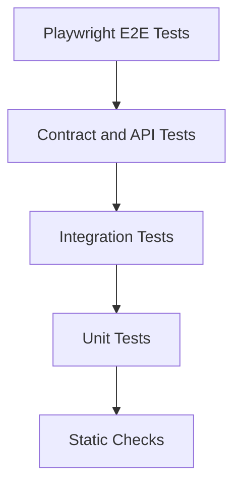

# Testing Strategy

ForgeML should treat tests as part of the architecture. No production code should be merged without appropriate tests for its layer and risk.

## Test Pyramid

```mermaid
flowchart TB
  E2E["Playwright E2E Tests"]
  Contract["Contract and API Tests"]
  Integration["Integration Tests"]
  Unit["Unit Tests"]
  Static["Static Checks"]

  E2E --> Contract
  Contract --> Integration
  Integration --> Unit
  Unit --> Static
```

## Backend Tests

### Unit Tests

Scope:

- Domain entities
- Value objects
- Policies
- Application services with mocked repositories
- Authorization decisions
- RBAC role matrix behavior
- Audit metadata redaction
- Schema compatibility checks
- Drift threshold logic

Rules:

- No network calls.
- No database dependency.
- Fast enough to run on every save.

### Integration Tests

Scope:

- SQLAlchemy repositories
- Multi-tenant repository isolation
- Alembic migrations
- Postgres constraints
- Redis rate limiting
- Object storage adapter
- MLflow adapter
- Airflow adapter contract boundaries

Rules:

- Use ephemeral infrastructure in CI.
- Reset database state per test or test class.
- Prefer real Postgres over SQLite for repository tests.

### API Tests

Scope:

- FastAPI routes
- Request and response validation
- Auth enforcement
- Rate-limit partitioning
- Error shapes
- Idempotency behavior
- Pagination

Rules:

- Exercise the API through HTTP clients.
- Assert permission boundaries.
- Assert trace IDs and stable error format.

## Frontend Tests

### Unit and Component Tests

Scope:

- Shared UI components
- Route guards
- Query hooks
- Form validation
- Table filtering and sorting
- State transitions

### Playwright E2E Tests

Critical flows:

- Login
- Create project
- Register dataset
- Finalize dataset version
- View validation result
- Launch training run
- Compare experiment runs
- Register and approve model
- Start canary rollout
- Roll back deployment
- View monitoring and alerts

Implementation guidance:

- Use network-level ForgeML API mocks for frontend CI so browser workflows stay deterministic and do not require Postgres, Redis, or object storage.
- Keep mocks stateful across pages so training success can feed model promotion, model approval can feed deployment, and inference snapshots can feed monitoring.
- Reserve live full-stack browser smoke tests for local operator validation and release-candidate environments.

## ML Workflow Tests

ML workflows need tests beyond ordinary application checks:

| Test Type | Purpose |
| --- | --- |
| Data validation tests | Ensure schema, nulls, ranges, and categorical constraints are enforced |
| Training smoke tests | Confirm each algorithm runner can train on a tiny fixture |
| Evaluation tests | Confirm metric calculations and report generation |
| Reproducibility tests | Confirm seeds and config produce stable expected behavior on fixture data |
| Model signature tests | Confirm inference contract matches registered signature |
| Drift tests | Confirm statistical tests trigger only when thresholds are crossed |

## Contract Tests

Contract tests should protect boundaries:

- Backend OpenAPI contract consumed by frontend.
- Problem Details API error envelope contract consumed by frontend and SDK clients.
- Alembic migration topology contract for base revision, head revision, parent links, and reversible migration hooks.
- SQLAlchemy schema metadata contract for registered tables, column shape, keys, constraints, and foreign-key index coverage.
- Runtime configuration policy contract enforced before production-like API startup.
- Security hardening contract for organization isolation, RBAC matrix, rate-limit partitioning, audit metadata redaction, and secrets/runtime guardrail evidence.
- Structured request logging contract with sensitive query-parameter redaction.
- Monitoring dashboard contract for project operations overview, inference errors, latency percentiles, drift trends, training failures, retraining activity, and frontend section coverage.
- Release smoke operations contract for the live API surfaces required during release-candidate validation.
- Release manifest operations contract for release artifact hashes, image targets, evidence types, and quality gates.
- Release evidence workflow contract for CI manifest publication behavior.
- Release manifest verification contract for artifact integrity and evidence linkage.
- MLflow tracking contract for adapter boundaries, REST endpoints, lineage tags, artifact-reference logging, and best-effort failure semantics.
- Airflow orchestration contract for gateway boundaries, REST DAG-run operations, training DAG conf payloads, state mapping, and polling API coverage.
- Deployment runtime contract for serving gateway boundaries, traffic semantics, rollback draining, revision routing, and health-probe API coverage.
- Inference runtime request/response schema.
- Event payload schemas under `contracts/events`.

MLflow integration tests cover the pure record builder, in-memory sync adapter,
HTTP REST request sequence, missing-experiment creation path, training service
sync reports, and sync-failure preservation of training terminal status.

Airflow orchestration tests cover local fallback status reporting, DAG trigger
payloads, deterministic DAG run ids, REST trigger/poll/cancel calls, external
state mapping, and API serialization of orchestration polling results.

Deployment runtime tests cover serving traffic planning, deployment service
canary and rollback behavior, runtime health probes, inference endpoint
revision resolution, API serialization, checked OpenAPI coverage, and CI
contract wiring.

Monitoring dashboard tests cover project operations aggregation, API
serialization, frontend rendering of inference, drift, training, and retraining
panels, checked OpenAPI coverage, and CI contract wiring.

## Release Smoke Tests

Release smoke tests should run after local seeding and against staging release candidates:

- Use `scripts/ops/release_smoke.py` for live API validation.
- Keep the smoke runner non-mutating so it can be repeated safely.
- Emit and archive the JSON report as release evidence.
- Cover health, auth, project context, datasets, feature store, experiments, training, training logs, registry, deployment, inference, monitoring, alerts, drift, and retraining.
- Keep CI focused on the checked operations contract; run live smoke in local operator validation and release-candidate environments.

## Release Manifest Tests

Release manifest tests should protect provenance and evidence quality:

- Hash every required checked contract and deployment artifact with SHA-256.
- Record source revision, branch, and worktree cleanliness.
- Capture Docker image targets and image digests when a promotion workflow provides them.
- Ingest release smoke JSON evidence when it is available.
- Keep the manifest contract checked in CI and production-readiness.

## Release Evidence Workflow Tests

Release evidence workflow tests should ensure CI does not silently stop publishing
release evidence:

- Require the release evidence job to depend on backend, frontend, Docker, and production-readiness jobs.
- Require manifest generation from `scripts/ops/build_release_manifest.py`.
- Require artifact upload through `actions/upload-artifact`.
- Fail when the manifest artifact path is missing.
- Keep workflow publication behavior captured in a checked operations contract.

## Release Manifest Verification Tests

Release manifest verification tests should prove release evidence can be checked
after it is created:

- Verify schema version, release metadata, source revision metadata, artifact hashes, Dockerfile hashes, quality gates, and CI evidence linkage.
- Fail when an artifact hash is tampered with.
- Fail when required quality gates are missing from the manifest.

## Demo Readiness Tests

Demo readiness tests should keep the reviewer path executable:

- Unit test the demo stack command plan without starting Docker or servers.
- Unit test seeded data refresh report generation with the API bootstrap boundary faked.
- Verify the checked demo readiness contract matches the command, runbook, screenshot, and architecture assets.
- Capture deterministic Playwright screenshots against stateful API mocks for reviewer-facing console surfaces.
- Include demo readiness in production-readiness and release manifest evidence.

## CI Runtime Tests

CI runtime tests should keep release evidence free of deprecated GitHub Actions
runtime pins:

- Verify required action major pins for the main CI workflow and Terraform plan workflow.
- Reject retired action refs such as old checkout, setup-python, setup-node, upload-artifact, and setup-terraform majors.
- Keep the CI runtime contract checked in backend CI, production-readiness, and release manifests.
- Update the release evidence workflow contract when artifact upload action majors intentionally change.

## Portfolio Readiness Tests

Portfolio readiness tests should keep reviewer-facing claims backed by source
evidence:

- Verify the portfolio readiness contract matches the checked reviewer assets.
- Require reviewer guide, resume bullets, evidence map, architecture diagrams, and screenshot catalog files.
- Validate that role-specific bullets cover ML Engineer, MLOps Engineer, AI Platform Engineer, and Backend / Platform Engineer applications.
- Verify Mermaid diagrams and screenshot catalog entries stay aligned with the deterministic demo screenshot flow.
- Include portfolio readiness in backend CI, production-readiness, and release manifest evidence.

## Release Evidence UX Tests

Release evidence UX tests should keep release artifacts visible and reviewable
from the web console:

- Verify the Release Evidence page renders manifest artifact, live retrieval,
  API drilldown, reviewer command, quality gate, and screenshot evidence sections.
- Require `/release-evidence` route and navigation coverage.
- Capture `09-release-evidence.png` in the deterministic Playwright screenshot
  flow.
- Verify the release evidence UX contract matches source files, portfolio docs,
  CI wiring, production-readiness, and release manifest evidence.

## Live Release Evidence Retrieval Tests

Live release evidence retrieval tests should keep GitHub Actions artifact
evidence machine-checkable without making CI depend on network access:

- Unit test the `ReleaseEvidenceGateway` protocol, GitHub Actions adapter, local
  manifest adapter, artifact archive extraction, and manifest comparison logic.
- Use injected transports in tests so GitHub API shape is covered
  deterministically.
- Verify the retrieval CLI emits a versioned report for local manifest and live
  GitHub Actions modes.
- Verify the release evidence retrieval contract matches source files, docs,
  Release Evidence UI, CI wiring, production-readiness, and release manifest
  evidence.

## Release Evidence Drilldown API Tests

Release evidence drilldown API tests should keep the in-product retrieval
workflow tenant-scoped, auditable, and backed by persisted reports:

- Unit test administration service permission checks, report lookup, successful
  retrieval, failed comparison, retrieval-provider errors, and audit actions.
- Integration test SQLAlchemy report persistence, JSON payload round-tripping,
  status filtering, newest-first ordering, and organization scoping.
- API test list, retrieve, and single-report endpoints through FastAPI dependency
  overrides.
- Frontend test authenticated report loading, Authorization headers, retrieve
  mutation behavior, and the API Evidence Drilldown panel.
- Verify the drilldown API contract matches backend sources, OpenAPI,
  permission catalog, Alembic migration, frontend API/UI, docs, CI wiring,
  production-readiness, and release manifest evidence.

## Release Evidence Scheduled Refresh Tests

Scheduled refresh tests should keep release evidence freshness visible without
requiring a long-running scheduler inside FastAPI:

- Unit test fresh, stale, missing, and latest-failed refresh status derivation
  from persisted release evidence reports.
- API test `GET /api/v1/admin/release-evidence/refresh/status` with
  tenant-scoped service wiring and configurable stale/refresh intervals.
- Unit test the operator refresh CLI for fresh skips, stale retrievals,
  dry-run behavior, JSON report serialization, and cron command generation.
- Frontend test authenticated refresh status loading, stale indicators,
  last-success summary, and the Scheduled Refresh panel.
- Verify the scheduled refresh contract matches backend sources, frontend
  API/UI, operator script, docs, CI wiring, production-readiness, OpenAPI, and
  release manifest evidence.

## External Training Package Adapter Tests

External package adapter tests should prove that ForgeML can run a reviewed ML
repository without coupling core modules to that repository:

- Unit test profile selection, command generation, relative data-path
  validation, timeout-aware process execution, failed-command mapping, metric
  import from `evaluation.json`, and artifact metadata with checksums.
- API test the training runner profile catalog route with RBAC and availability
  details.
- Frontend test the Training Runs profile panel and prefilled run creation
  payload.
- Run a live local smoke against
  `$HOME/Documents/GitHub/conversational-movie-recommender` when the repo is
  present.
- Verify the external training package contract matches backend sources,
  worker wiring, frontend UI, docs, CI wiring, production-readiness, and release
  manifest evidence.

## Operational Audit UX Tests

Operational audit UX tests should keep operator-facing timeline evidence
traceable across live audit rows and release annotations:

- Verify the Operational Audit page renders live admin audit events, release
  evidence annotations, family filters, and selected-event detail drilldowns.
- Unit test the audit timeline adapter for release evidence, deployment,
  retraining, security, registry, dataset, training, and monitoring
  classification.
- Require `/operational-audit` route and navigation coverage.
- Capture `10-operational-audit.png` in the deterministic Playwright screenshot
  flow.
- Verify the operational audit UX contract matches source files, portfolio
  docs, CI wiring, production-readiness, and release manifest evidence.

## Artifact Manifest Tests

Artifact manifest tests protect object-store metadata and lineage:

- Validate deterministic dataset and model artifact manifest serialization.
- Verify manifest payload SHA-256 checksums after storage writes.
- Reject tampered payloads through checksum validation.
- Round-trip `artifact_manifest_uri` and `artifact_manifest_hash` through dataset and model repositories.
- Keep the artifact manifest contract checked in backend CI, release provenance, and production-readiness.
- Optionally require Docker image digests for promotion workflows that publish immutable images.
- Keep verifier behavior captured in a checked operations contract.

## CI Gates

Every pull request should run:

- Backend formatting check
- Backend lint
- Backend type check where configured
- Backend unit tests
- Backend integration tests
- API tests
- Alembic migration contract check
- SQLAlchemy schema contract check
- Frontend formatting check
- Frontend lint
- Frontend type check
- Frontend unit tests
- Playwright lifecycle E2E test
- Docker build
- Terraform format and validate when infra changes

## Coverage Expectations

Coverage should be risk-based:

| Area | Expectation |
| --- | --- |
| Domain policies | High unit coverage |
| Application services | High use-case coverage |
| Repositories | Integration coverage for each query path |
| API routes | Route, auth, validation, and error coverage |
| UI critical flows | Playwright coverage |
| ML runners | Smoke and reproducibility coverage |

## Test Data Strategy

- Use small deterministic fixtures.
- Keep large sample datasets out of git.
- Use generated synthetic data for fraud and recommendation tests.
- Use tiny embedded corpora for semantic search tests.
- Store golden reports only when they are stable and useful.
