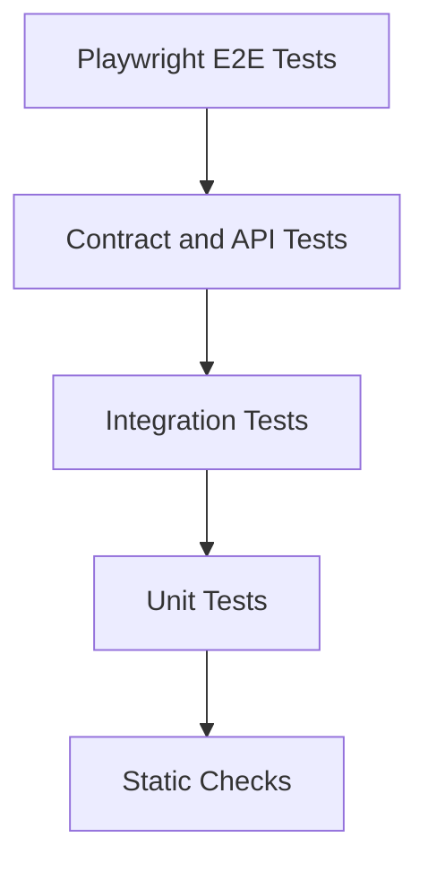

# Testing Strategy

ForgeML should treat tests as part of the architecture. No production code should be merged without appropriate tests for its layer and risk.

## Test Pyramid

```mermaid
flowchart TB
  E2E["Playwright E2E Tests"]
  Contract["Contract and API Tests"]
  Integration["Integration Tests"]
  Unit["Unit Tests"]
  Static["Static Checks"]

  E2E --> Contract
  Contract --> Integration
  Integration --> Unit
  Unit --> Static
```

## Backend Tests

### Unit Tests

Scope:

- Domain entities
- Value objects
- Policies
- Application services with mocked repositories
- Authorization decisions
- Schema compatibility checks
- Drift threshold logic

Rules:

- No network calls.
- No database dependency.
- Fast enough to run on every save.

### Integration Tests

Scope:

- SQLAlchemy repositories
- Alembic migrations
- Postgres constraints
- Redis rate limiting
- Object storage adapter
- MLflow adapter
- Airflow adapter contract boundaries

Rules:

- Use ephemeral infrastructure in CI.
- Reset database state per test or test class.
- Prefer real Postgres over SQLite for repository tests.

### API Tests

Scope:

- FastAPI routes
- Request and response validation
- Auth enforcement
- Error shapes
- Idempotency behavior
- Pagination

Rules:

- Exercise the API through HTTP clients.
- Assert permission boundaries.
- Assert trace IDs and stable error format.

## Frontend Tests

### Unit and Component Tests

Scope:

- Shared UI components
- Route guards
- Query hooks
- Form validation
- Table filtering and sorting
- State transitions

### Playwright E2E Tests

Critical flows:

- Login
- Create project
- Register dataset
- Finalize dataset version
- View validation result
- Launch training run
- Compare experiment runs
- Register and approve model
- Start canary rollout
- Roll back deployment
- View monitoring and alerts

Implementation guidance:

- Use network-level ForgeML API mocks for frontend CI so browser workflows stay deterministic and do not require Postgres, Redis, or object storage.
- Keep mocks stateful across pages so training success can feed model promotion, model approval can feed deployment, and inference snapshots can feed monitoring.
- Reserve live full-stack browser smoke tests for local operator validation and release-candidate environments.

## ML Workflow Tests

ML workflows need tests beyond ordinary application checks:

| Test Type | Purpose |
| --- | --- |
| Data validation tests | Ensure schema, nulls, ranges, and categorical constraints are enforced |
| Training smoke tests | Confirm each algorithm runner can train on a tiny fixture |
| Evaluation tests | Confirm metric calculations and report generation |
| Reproducibility tests | Confirm seeds and config produce stable expected behavior on fixture data |
| Model signature tests | Confirm inference contract matches registered signature |
| Drift tests | Confirm statistical tests trigger only when thresholds are crossed |

## Contract Tests

Contract tests should protect boundaries:

- Backend OpenAPI contract consumed by frontend.
- Problem Details API error envelope contract consumed by frontend and SDK clients.
- Alembic migration topology contract for base revision, head revision, parent links, and reversible migration hooks.
- SQLAlchemy schema metadata contract for registered tables, column shape, keys, constraints, and foreign-key index coverage.
- Runtime configuration policy contract enforced before production-like API startup.
- Structured request logging contract with sensitive query-parameter redaction.
- Release smoke operations contract for the live API surfaces required during release-candidate validation.
- MLflow adapter expected behavior.
- Airflow DAG trigger and status interface.

## Release Smoke Tests

Release smoke tests should run after local seeding and against staging release candidates:

- Use `scripts/ops/release_smoke.py` for live API validation.
- Keep the smoke runner non-mutating so it can be repeated safely.
- Emit and archive the JSON report as release evidence.
- Cover health, auth, project context, datasets, feature store, experiments, training, training logs, registry, deployment, inference, monitoring, alerts, drift, and retraining.
- Keep CI focused on the checked operations contract; run live smoke in local operator validation and release-candidate environments.
- Inference runtime request/response schema.
- Event payload schemas under `contracts/events`.

## CI Gates

Every pull request should run:

- Backend formatting check
- Backend lint
- Backend type check where configured
- Backend unit tests
- Backend integration tests
- API tests
- Alembic migration contract check
- SQLAlchemy schema contract check
- Frontend formatting check
- Frontend lint
- Frontend type check
- Frontend unit tests
- Playwright lifecycle E2E test
- Docker build
- Terraform format and validate when infra changes

## Coverage Expectations

Coverage should be risk-based:

| Area | Expectation |
| --- | --- |
| Domain policies | High unit coverage |
| Application services | High use-case coverage |
| Repositories | Integration coverage for each query path |
| API routes | Route, auth, validation, and error coverage |
| UI critical flows | Playwright coverage |
| ML runners | Smoke and reproducibility coverage |

## Test Data Strategy

- Use small deterministic fixtures.
- Keep large sample datasets out of git.
- Use generated synthetic data for fraud and recommendation tests.
- Use tiny embedded corpora for semantic search tests.
- Store golden reports only when they are stable and useful.
